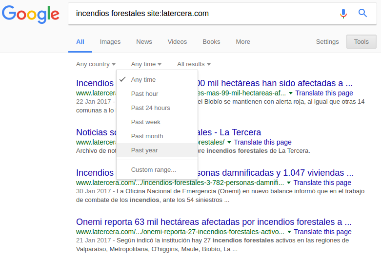
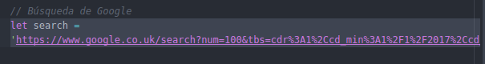

# Instrucciones:

1. Realiza una búsqueda en Google escogiendo el término que quieres obtener como resultado, seguido del sitio de noticias que deseas usar como fuente de tus datos:

> "incendios forestales site:latercera.com"

En el ejemplo anterior 'incendios forestales' fue el término(s) utilizado, y se escogió 'La Tercera' como el medio que será la fuente de nuestros datos. La ventaja de realizar ésta búsqueda es que podemos acotar el tiempo de los resultados, y ciertamente funciona mejor que muchos buscadores internos de noticias provistos por los mismos periódicos.

Usando la **Tools** en la búsqueda de Google, podemos delimitar el tiempo en el cual las noticias fueron publicadas. Presiones en tools y luego escogemos todas las noticias del último año. De la siguiente manera:

2. Ahora vamos el código. Abre el código en el editor de texto que prefieras. Si tienes instalado Atom, Sublime, Brackets o Node++ es aún mejor.

Una vez que el código esté abierto. Copia el link de la búsqueda de Google y pégalo en la variable '**search**'. La variable que estás pegando corresponde a texto (*string*), por lo que debe estar encerrado por comillas ('' o ""). De esta manera:

3. Abrir terminal e instalar el ejercicio 'npm install package.json'.

4. Hacer correr el código: node index.js

5. Transformar JSON a CSV: https://konklone.io/json/

6. Limpiar código en editor de planillas.

7. Subir las primeras 30 palabras en http://app.rawgraphs.io/ y editar visualización.

8. Bajar PNG e interpretar resultados de acuerdo a la pregunta inicial.

9. Ajustes finales y terminar post. Escribir nombre de autores al final del artículo y subir a Google Drive.
